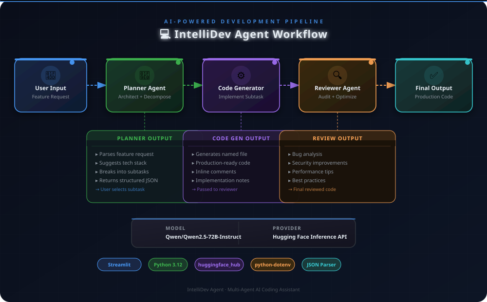
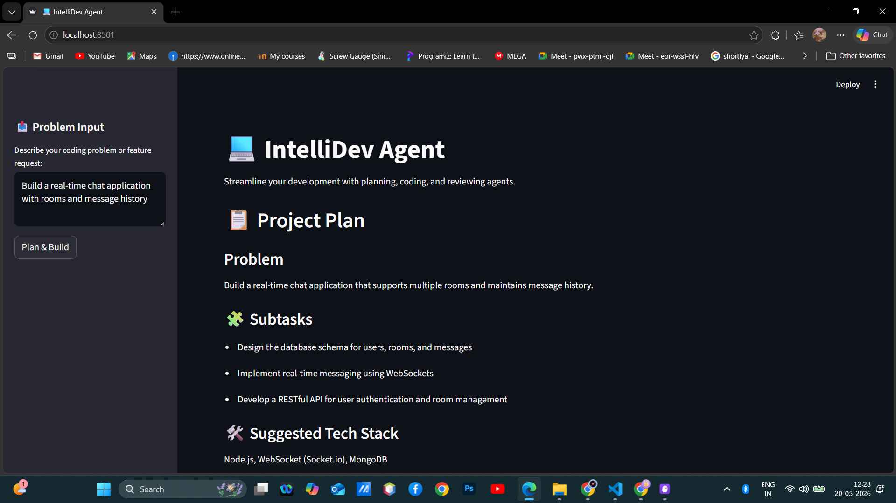
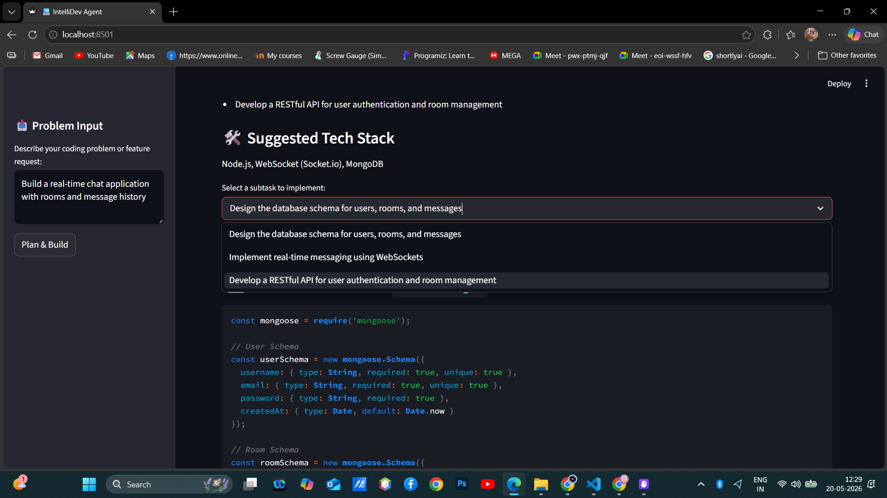
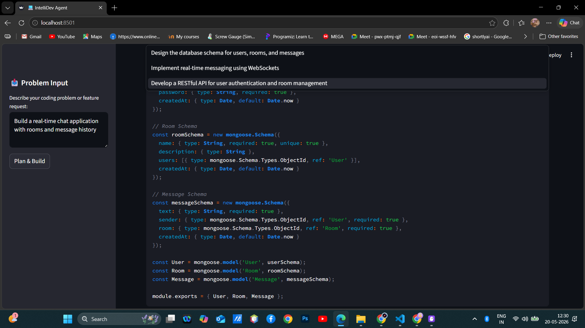
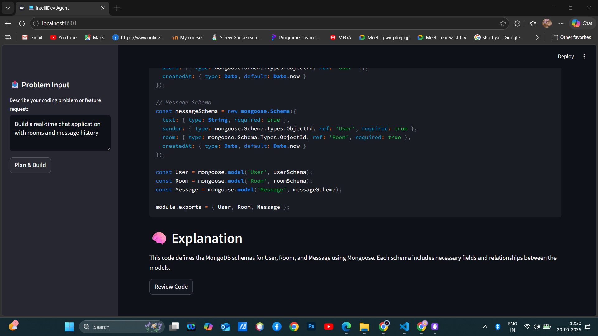
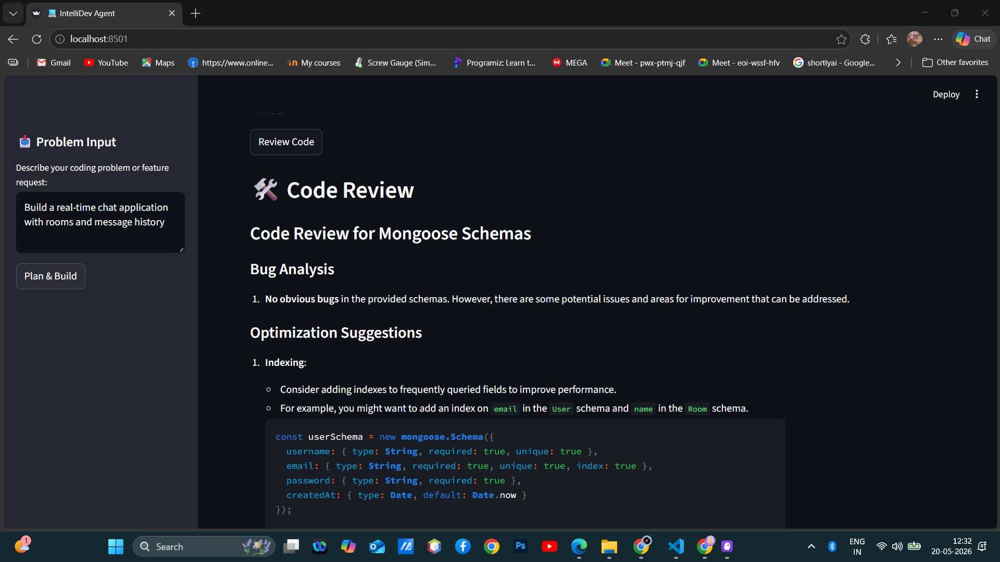
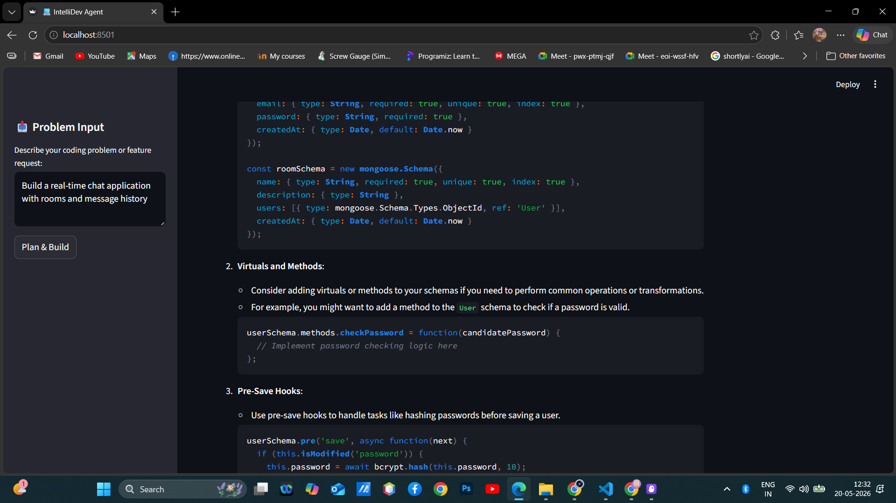
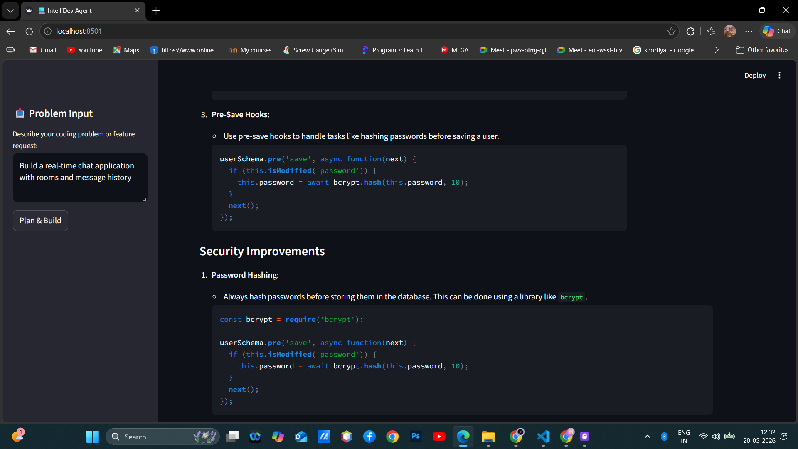
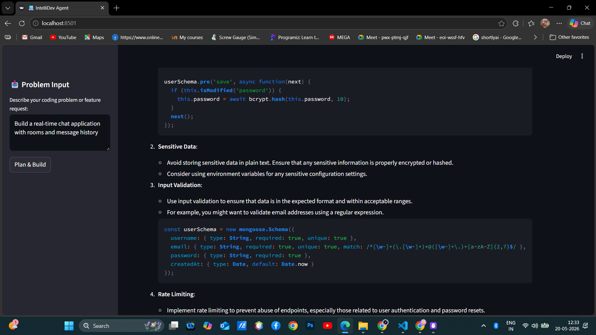
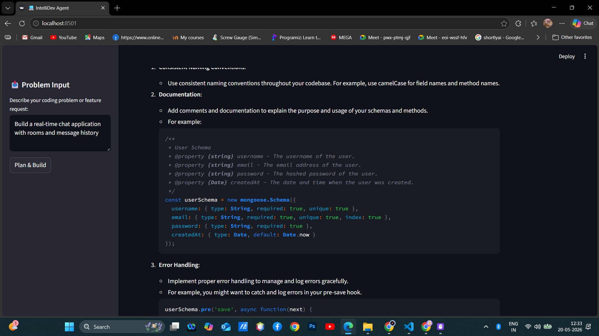

# 💻 IntelliDev Agent

> 🤖 A multi-agent AI coding assistant built with Streamlit and Hugging Face. Describe a feature, get an architecture plan, generate production-ready code, and run an automated review — all in one workflow.

[](https://github.com/Snehlata1111/multi-agent-code-generator)
[](https://python.org)
[](https://streamlit.io)
[](https://huggingface.co)

---

## 🔄 Pipeline Workflow



---

## 📸 Screenshots

**1. Enter your feature request and click Plan & Build**



**2. Planner Agent generates project plan, subtasks and tech stack**



**3. Select a subtask to implement from the dropdown**



**4. Code Generator produces a named file with full implementation**



**5. Generated code view**



**6. Scrolling through the complete code output**



**7. Explanation section below the generated code**



**8. Review Code button triggers the Reviewer Agent**



**9. Reviewer Agent output with bug analysis and suggestions**



---

## 🤖 The SDE Pipeline

Three autonomous agents work in sequence:

### 1. Planner Agent
- Analyzes your development requirement
- Suggests a modern, appropriate tech stack
- Breaks the project into actionable, prioritized subtasks

### 2. Code Generator Agent
- Implements the subtask selected by the user
- Generates clean, production-ready, well-commented code
- Provides a contextual explanation of the implementation

### 3. Code Reviewer Agent
- Reviews the generated code for bugs, security issues, and performance bottlenecks
- Suggests optimizations following industry best practices

---

## ✨ Key Features

- **Smart Decomposition** — Turns vague requirements into concrete engineering plans
- **Context-Aware Code** — The coder respects the tech stack suggested by the planner
- **Adversarial Review** — A separate reviewer persona ensures code quality
- **User-in-the-Loop** — You choose which subtasks to implement
- **Robust JSON Parsing** — Multi-strategy extractor handles complex model responses reliably

---

## 🛠️ Tech Stack

| Layer | Technology |
|---|---|
| Model | `Qwen/Qwen2.5-72B-Instruct` via Hugging Face Inference API |
| UI | Streamlit |
| Language | Python 3.12 |
| API Client | `huggingface_hub` (chat completions) |
| Config | `python-dotenv` |

---

## 🚀 Setup & Run

### 1. Clone the repo
```bash
git clone https://github.com/Snehlata1111/multi-agent-code-generator.git
cd multi-agent-code-generator
```

### 2. Install dependencies
```bash
pip install streamlit huggingface_hub python-dotenv
```

### 3. Configure your API key

Copy `.env.example` to `.env` and add your Hugging Face token:
```
HF_API_KEY=hf_your_token_here
```

Get a free token at [huggingface.co/settings/tokens](https://huggingface.co/settings/tokens).

### 4. Run the app
```bash
streamlit run coding_agent.py
```

The app opens at **http://localhost:8501**.

---

## 💡 Example Prompts

```
Build a REST API for a todo list app with CRUD operations
```
```
Create a user authentication system with login and signup
```
```
Build a real-time chat application with rooms and message history
```
```
Create a URL shortener service with click tracking and analytics
```

---

## 🔄 How It Works

1. Enter your feature request in the sidebar and click **Plan & Build**
2. The Planner Agent returns a project summary, subtasks, and suggested tech stack
3. Select a subtask from the dropdown and click **Generate Code**
4. The Code Generator produces a named file with full implementation and explanation
5. Click **Review Code** to run the Reviewer Agent on the generated output

---

<div align="center">
    <b>Empowering Developers with Autonomous Engineering Agents</b><br/>
    <a href="https://github.com/Snehlata1111/multi-agent-code-generator">github.com/Snehlata1111/multi-agent-code-generator</a>
</div>
